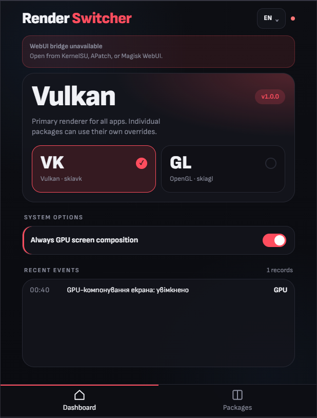
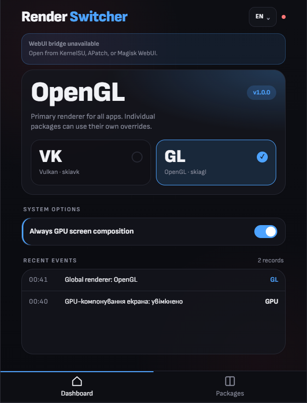

<div align="center">

### 👇

  <p>
    <a href="https://github.com/EXLOUD/Render-Switcher/releases/download/v1.0.0/Render_Switcher_v1.0.0.zip">
      
    </a>
  </p>

---

### 👀 Статистика репозиторію

  

  **⭐ Якщо модуль став вам у пригоді, поставте зірочку! ⭐**

---

  <h1>Render Switcher</h1>

  **Мова:** [English](README.md) | [Українська](#)

  <p>
    
    
  </p>

  
  
  
  

  Керування HWUI-рендерером (Vulkan / OpenGL) для кожного застосунку окремо на Android з root-доступом.
  Оберіть глобальний рендерер один раз, а для окремих застосунків задайте власний.

</div>

---

**Автор:** EXLOUD  
**GitHub:** https://github.com/EXLOUD

## 📋 Опис

Render Switcher дозволяє обрати, який HWUI-бекенд використовує Android: **Vulkan** (`skiavk`) або **OpenGL** (`skiagl`).

- **Глобальне значення за замовчуванням** застосовується під час завантаження для всіх застосунків.
- **Перевизначення для окремих застосунків** дають змогу запускати вибрані програми на іншому рендерері, не чіпаючи решту системи.

Усім можна керувати через вбудований **WebUI** або консольну утиліту **`skiactl`**.

## 🔧 Системні вимоги

- **Root:** Magisk, KernelSU або APatch
- **Zygisk:** увімкнений (вбудований Zygisk у Magisk) або реалізація Zygisk, як-от Zygisk Next / ReZygisk / NeoZygisk (KernelSU, APatch)
- **Архітектура:** arm64-v8a, armeabi-v7a, x86, x86_64

## 🚀 Встановлення

1. Відкрийте менеджер root (Magisk / KernelSU / APatch)
2. Встановіть `Render_Switcher_v1.0.0.zip` як модуль
3. Переконайтесь, що **Zygisk увімкнений**
4. Перезавантажте пристрій
5. Відкрийте **WebUI** модуля та додайте застосунки, для яких потрібне перевизначення

## ⚙️ Як це працює

| Рівень | Роль |
|--------|------|
| **Глобальне значення** | `post-fs-data` рано під час завантаження встановлює `debug.hwui.renderer` (за замовчуванням `skiavk`) |
| **Окремі застосунки** | Модуль Zygisk одразу після specialize змінює властивості рендерера в **приватних copy-on-write сторінках властивостей** застосунку. Спільна системна область властивостей не змінюється, PLT-хуки не використовуються. |

Змінюються лише пакети зі списку `targets.conf`. Інші застосунки не зачіпаються і не створюють записів у журналі.

## 🖥️ WebUI

- **Dashboard:** перемикач глобального рендерера, системні опції та журнал останніх подій
- **Packages:** список застосунків із пошуком (User / System / All) і вибором рендерера для кожного: *Default*, *Vulkan* або *OpenGL*
- Інтерфейс англійською та українською
- Системна опція **Always GPU screen composition** (`persist.skia.force_gpu`)

Відкривайте його зі списку модулів у менеджері root.

## 💻 Командний рядок

```sh
/data/adb/modules/render_switcher/bin/skiactl status
```

| Команда | Опис |
|---------|------|
| `skiactl status` | Показати глобальний рендерер, шляхи та цілі |
| `skiactl renderer get` | Показати глобальний рендерер |
| `skiactl renderer set <skiavk\|skiagl>` | Встановити глобальний рендерер |
| `skiactl target list` | Список перевизначень |
| `skiactl target add <pkg> <renderer>` | Додати перевизначення для застосунку |
| `skiactl target set <pkg> <renderer>` | Змінити рендерер застосунку |
| `skiactl target get <pkg>` | Показати рендерер і стан застосунку |
| `skiactl target enable\|disable <pkg>` | Увімкнути/вимкнути перевизначення без видалення |
| `skiactl target remove <pkg>` | Видалити перевизначення |
| `skiactl zygisk` | Перевірити, що Zygisk активний (`ok` / `missing`) |
| `skiactl logs` | Показати журнал модуля |
| `skiactl packages [user\|system\|all]` | Список встановлених пакетів |

Приклад:

```sh
skiactl target add com.example.game skiagl
skiactl renderer set skiavk
```

Цільовий застосунок примусово зупиняється автоматично, тож новий рендерер буде використано під час наступного запуску.

## 📁 Конфігурація

Дані зберігаються поза папкою модуля й переживають його оновлення:

```
/data/adb/render_switcher/
├── config/
│   ├── targets.conf      # package=renderer
│   └── settings.conf     # GLOBAL_RENDERER=skiavk
├── state/
├── locks/
└── render_switcher.log
```

Формат `targets.conf`:

```
com.example.game=skiagl
com.example.app=skiavk
```

Допустимі рендерери: `skiavk` | `skiagl`.

## 📦 Структура модуля

```
📄 module.prop
📄 customize.sh           # Інсталятор
📄 post-fs-data.sh        # Ранній етап завантаження: глобальний рендерер
📄 service.sh             # Пізній етап завантаження
📄 uninstall.sh           # Повне очищення
📂 bin/skiactl            # CLI
📂 common/                # Shell-бібліотеки
📂 scripts/boot.sh        # Логіка завантаження
📂 config/                # Конфігурація за замовчуванням
📂 webroot/               # WebUI
📂 zygisk/                # Вихідники нативного модуля + скрипти збірки
📂 docs/
📂 tests/                # Mock environment + tests
```

## 🛡️ Безпека

- **Захист від bootloop:** якщо пристрій кілька разів поспіль не встигає завантажитись, модуль автоматично вимикає застосування змін, щоб не залишити вас у циклі перезавантажень.
- **Видалення:** під час видалення модуля папка `/data/adb/render_switcher` (цілі, налаштування, журнал) стирається, а runtime-властивості модуля скидаються.
- **Ручне вимкнення:** створіть файл `disable` у папці модуля або вимкніть модуль у менеджері root.

## ⚠️ Важливі застереження

- Використовуйте на власний ризик. Не кожен застосунок чи драйвер GPU однаково працює на обох рендерерах, тож змінюйте по одному застосунку.
- Зміна перевизначення набуває чинності після **перезапуску** застосунку.
- Після встановлення або оновлення модуля рекомендується перезавантаження.

## 🆘 Усунення несправностей

**Перевизначення для застосунку не працює**
- Переконайтесь, що Zygisk увімкнений: `skiactl zygisk` має вивести `ok`
- Перевірте, що застосунок є у списку й увімкнений: `skiactl target get <pkg>`
- Перезапустіть застосунок і перегляньте `skiactl logs`

**Після завантаження глобальний рендерер неправильний**
- Виконайте `skiactl renderer get` і перегляньте `skiactl logs`
- Якщо спрацював захист від bootloop, застосування змін вимкнене до перевстановлення модуля

**WebUI показує «WebUI bridge unavailable»**
- Відкривайте WebUI з KernelSU, APatch або екрана модулів Magisk, а не зі звичайного браузера

## 🔨 Збірка з вихідного коду

Це повне дерево вихідного коду. Релізний ZIP додатково містить скомпільовані бібліотеки `zygisk/<abi>.so`, яких тут **немає**.

**Потрібно:** Android NDK r25+, CMake 3.18+ (Linux / macOS / WSL / Windows)

```sh
cd zygisk
export ANDROID_NDK_HOME=$HOME/Android/Sdk/ndk/27.0.12077973   # ваш шлях до NDK
./build.sh                          # усі ABI
./build.sh arm64-v8a armeabi-v7a    # лише вибрані ABI
```

У Windows використовуйте `build.bat`. Результат: `zygisk/arm64-v8a.so`, `armeabi-v7a.so`, `x86.so` та `x86_64.so`.

**Пакування:** заархівуйте корінь модуля (`module.prop` має бути на верхньому рівні архіву) і встановіть через менеджер root. Для релізу бібліотеки можна спершу стрипнути (`strip --strip-unneeded`), а `tests/`, `scripts/check.sh` та вихідники й скрипти збірки з `zygisk/` не додавати в архів.

Докладніше: [`zygisk/BUILD.md`](zygisk/BUILD.md), [`docs/RENDERER_ISOLATION_V1_0_0.md`](docs/RENDERER_ISOLATION_V1_0_0.md), [`docs/ARCHITECTURE.md`](docs/ARCHITECTURE.md).

**Перевірки (на ПК або пристрої):**

```sh
sh scripts/check.sh        # статичні перевірки
sh tests/test_targets.sh   # тести менеджера цілей із мок-середовищем
```

## 📞 Підтримка

- **GitHub:** https://github.com/EXLOUD

---

<div align="center">

**Увага:** Цей модуль змінює системні графічні властивості. Переконайтесь, що ви розумієте наслідки перед використанням.

**[⬆ Повернутись до початку](#render-switcher)**

</div>
